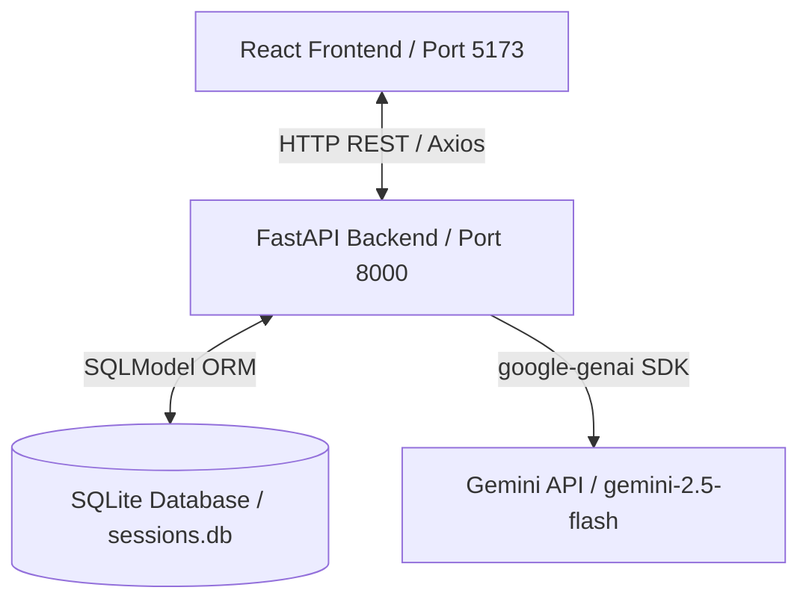

# 🎙️ AI Interview Coach

An AI-powered, single-question mock interview practice platform. Built as a lightweight MVP to help developers practice domain-specific questions, receive immediate scores, actionable feedback, and compile a local dashboard history.

---

## 🔍 Overview

**AI Interview Coach** is designed to address a common pain point: preparing for technical and behavioral interviews with real-time feedback without the complexity of heavy setups. 

The application utilizes a single-question loop workflow:
1. **Initiate Practice**: Start a new session.
2. **Select Domain**: Choose from **Python Programming**, **Data Structures & Algorithms (DSA)**, or **HR behavioral** paths.
3. **Question Generation**: The FastAPI backend prompts Gemini (`gemini-2.5-flash`) using topic-tailored system instructions.
4. **Answer Submission**: The candidate writes their conceptual response or code block.
5. **AI Evaluation**: The backend invokes Gemini to evaluate the answer, returning a structured score, qualitative feedback, and improvement tips. (Includes a robust **local heuristic fallback** if API key is missing or offline).
6. **Dashboard Logs**: Complete the session and review performance summaries on a historic list view.

---

## ✨ Features

- **Domain-Specific Question Tracks**:
  - **Python**: Tests OOP, decorators, generators, memory limits, and syntax mechanics.
  - **Data Structures & Algorithms (DSA)**: Focuses on algorithmic structure, graph/tree searches, and Big-O efficiency analysis without requiring full code compilations.
  - **HR Interview**: Behavioral questions designed around the STAR response method.
- **Robust Evaluation**: Parses and validates scoring (0–100), detailed feedback, and suggested modifications.
- **Local Fallback Mode**: If Gemini API credentials are absent or connection is lost, a local heuristic evaluator grades and logs the session to keep the practice flow active.
- **Performance History Logs**: Tabular dashboard with inline drawer details to review previous answers and feedback.
- **Prefix-Free API**: Clean FastAPI routing mapping strictly to the database tables.

---

## 🛠️ Tech Stack

### Backend
- **FastAPI**: Modern, high-performance web framework for building APIs.
- **SQLModel**: Expressive Python SQL library combining SQLAlchemy and Pydantic.
- **SQLite**: Local, lightweight serverless database.
- **Google Gemini API**: Powered by the official `google-genai` client SDK (`gemini-2.5-flash`).

### Frontend
- **React.js**: Standard single-page application framework.
- **Vite**: Rapid-bundling frontend build tool.
- **Tailwind CSS**: Utility-first CSS styling for dark-mode layout designs.
- **Axios**: Promised-based HTTP client for API integration.

---

## 📐 Architecture

The application implements a decoupled three-tier architecture where the backend coordinates database records and AI services independently:



---

## 📂 Project Structure

```text
ai-interview-coach/
├── backend/
│   ├── app/
│   │   ├── routes/
│   │   │   ├── __init__.py
│   │   │   ├── questions.py       # Handles question creation & answers
│   │   │   └── sessions.py        # Handles session creation & history
│   │   ├── services/
│   │   │   ├── __init__.py
│   │   │   └── gemini.py          # Interfaces with Google Gemini API
│   │   ├── __init__.py
│   │   ├── database.py            # SQLite connection settings
│   │   ├── models.py              # SQLModel schema configurations
│   │   ├── schemas.py             # Pydantic schema validation models
│   │   └── main.py                # Server setup, lifespan events, and CORS
│   └── tests/
│       └── test_api.py            # Automated backend API validation
├── docs/                          # MVP System Design Documents
├── frontend/
│   ├── src/
│   │   ├── pages/
│   │   │   ├── Dashboard.jsx      # Historic logs & inline details
│   │   │   ├── Home.jsx           # Landing splash screen
│   │   │   ├── Interview.jsx      # Question & submission workflow
│   │   │   └── TopicSelection.jsx # Domain path selection cards
│   │   ├── services/
│   │   │   └── api.js             # Axios client configurations
│   │   ├── App.jsx                # Main router & app layout coordinator
│   │   ├── index.css              # Custom styling definitions
│   │   └── main.jsx               # React entry wrapper
│   ├── index.html
│   ├── tailwind.config.js         # Tailwind utility configuration
│   └── package.json
├── .env.example                   # Local configuration template
└── requirements.txt               # Backend Python library list
```

---

## 🚀 Installation & Setup

### Prerequisites
* **Python 3.13** or higher
* **Node.js 18.x** or higher (with `npm`)

### 1. Environment Configuration
Clone the repository, navigate to the root directory, and set up your local configuration file:

```bash
cp .env.example .env
```

Open `.env` and add your Google Gemini API Key:
```env
# Google Gemini API Configuration
GEMINI_API_KEY=your_real_gemini_api_key_here
DATABASE_URL=sqlite:///sessions.db
```

> 💡 **Note**: If you run the project without a `GEMINI_API_KEY`, the application will seamlessly default to **Offline Fallback Mode**, generating static practice questions and heuristic evaluations locally.

---

### 2. Running the Backend

Install the required packages:
```bash
python -m pip install -r requirements.txt
```

Navigate to the `backend` directory and start the Uvicorn development server:
```bash
cd backend
python -m uvicorn app.main:app --port 8000 --reload
```
The API docs will be active at:
* Swagger UI: [http://127.0.0.1:8000/docs](http://127.0.0.1:8000/docs)
* Redoc: [http://127.0.0.1:8000/redoc](http://127.0.0.1:8000/redoc)

---

### 3. Running the Frontend

In a new terminal window, navigate to the `frontend` folder and install NPM packages:
```bash
cd frontend
npm install
```

Start the Vite React development server:
```bash
npm run dev
```
Open [http://localhost:5173/](http://localhost:5173/) in your web browser.

---

## 🔌 API Endpoints

All backend endpoints are prefix-free:

| Method | Endpoint | Request Body | Description |
|:---|:---|:---|:---|
| **POST** | `/sessions` | `{ "topic": "Python" }` | Initializes a new mock interview session. |
| **POST** | `/sessions/{session_id}/questions` | *None* | Generates the single question via Gemini. |
| **POST** | `/questions/{question_id}/answer` | `{ "user_answer": "..." }` | Submits candidate response for evaluation. |
| **POST** | `/sessions/{session_id}/complete` | *None* | Marks session completed and writes summary. |
| **GET** | `/sessions` | *None* | Returns a historic list of all practice sessions. |
| **GET** | `/sessions/{session_id}` | *None* | Retrieves a specific session's history & QA details. |

---

## 💾 Database Schema

The SQLite schema consists of exactly two related tables:

### 1. `InterviewSession` Table (`interview_session`)
Stores information about the overall practice attempt.
- `id` (Integer, Primary Key)
- `topic` (String: `Python`, `DSA`, or `HR`)
- `created_at` (DateTime, Defaults to UTC Now)
- `overall_score` (Float, Nullable): Calculated based on the single question score.
- `summary` (String, Nullable): Generated AI evaluation overview.
- `is_completed` (Boolean, Default `False`)

### 2. `InterviewQuestion` Table (`interview_question`)
Stores question data and corresponding answer/evaluation results.
- `id` (Integer, Primary Key)
- `session_id` (Integer, Foreign Key references `interview_session.id`)
- `question_text` (String)
- `user_answer` (String, Nullable)
- `score` (Integer, Nullable): Graded score between 0 and 100.
- `feedback` (String, Nullable): Qualitative AI analysis.
- `improvement_suggestions` (String, Nullable): Actionable AI modification list.
- `timestamp` (DateTime, Defaults to UTC Now)

---

## 📸 Screenshots

*(Placeholder for interface screenshots)*
| Home Screen | Topic Selection |
|:---:|:---:|
|  |  |

| Interview Page | Dashboard History |
|:---:|:---:|
|  |  |

---

## 🎥 Demo

*(Placeholder for application walkthrough video/GIF)*

---

## 🧪 Testing

We have built a dedicated API testing script in `backend/tests/test_api.py`. It runs without any external testing dependency (using standard python assertions and FastAPI's `TestClient` utility).

To execute the validation tests, run:
```bash
python backend/tests/test_api.py
```

Expected output:
```text
Starting E2E API Validation...
[OK] Health Check passed
[OK] Create Session passed
[OK] List Sessions passed
[OK] Generate Question (Fallback) passed
[OK] Duplicate Question Check passed
[OK] Get Session Detail passed
[OK] Complete Session passed

*** ALL BACKEND API TESTS PASSED SUCCESSFULLY! ***
```

---

## 🛡️ Challenges Faced & Solutions

### 1. Python 3.13 Binary Wheel Compatibility
* **Challenge**: Pinned library versions (e.g. older `pydantic`) caused `pip install` to try building `pydantic-core` from source, which failed due to a missing local Rust compilation environment on Windows.
* **Solution**: Updated `requirements.txt` to relax constraints to newer versions (`pydantic>=2.9.0`), which ship with prebuilt binary wheels native to Python 3.13.

### 2. Case Mismatches in Network Payloads
* **Challenge**: The React frontend sent answer keys as `userAnswer` (camelCase), but the Pydantic validator on FastAPI expected `user_answer` (snake_case), causing `422 Unprocessable Entity` validation failures.
* **Solution**: Reconfigured the Axios request body in `api.js` to map directly to standard database snake_case keys.

### 3. Crash on Nested Error Objects in React
* **Challenge**: When validation errors or API errors occurred, FastAPI returned structured dictionary error arrays. React threw rendering errors when trying to render these objects as plain child elements.
* **Solution**: Implemented a custom `parseErrorMessage` utility inside React components to map and join nested details into flat, readable string messages.

---

## 💡 Learning Outcomes

- Learned to design and deploy lightweight MVPs with strict feature scoping (enforcing a single-question loop, no auth, and simple 4-page UI).
- Gained experience using the new `google-genai` SDK and structured model prompt patterns.
- Acquired proficiency combining SQLModel (Pydantic + SQLAlchemy) to construct lightweight API services.
- Learned best practices for handling API connectivity fallbacks on resource-constrained platforms.

---

## 👤 Author

* **Varun Sandhu**
* GitHub: [@Sandhuu010](https://github.com/Sandhuu010)

---

## 📄 License
This project is intended for educational and learning purposes.