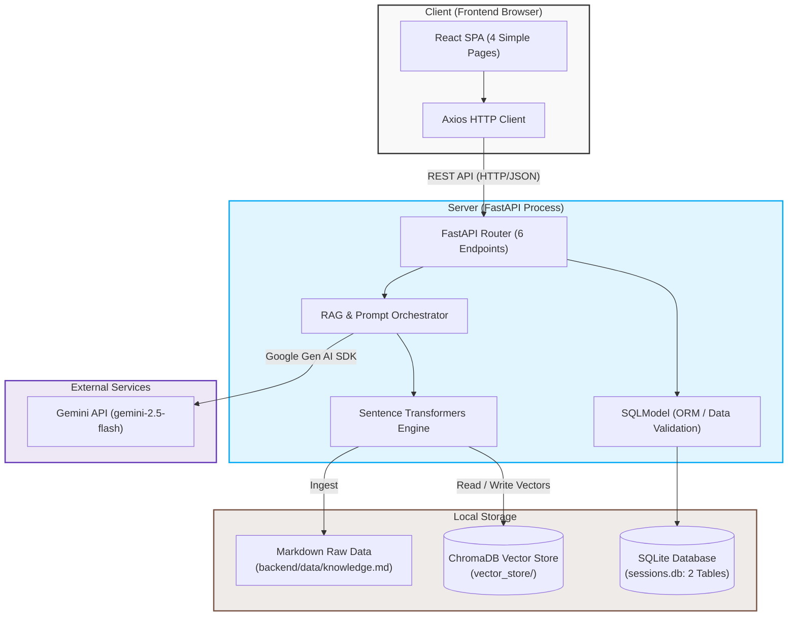
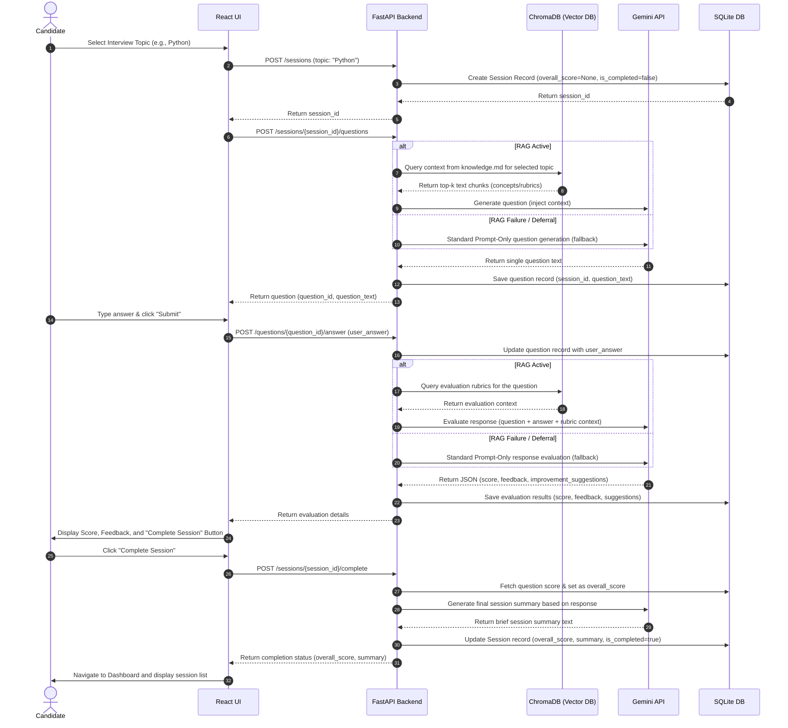
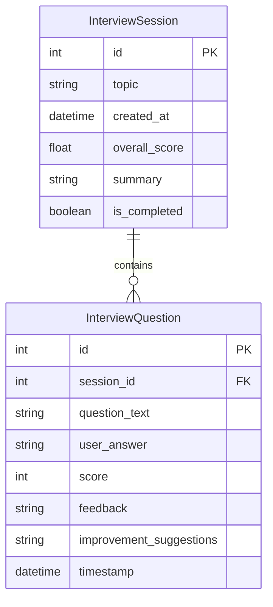

# System Architecture: AI Interview Coach

This document details the system architecture, component design, data flow, API specifications, and database schema for the AI Interview Coach.

---

## 1. System Overview
The AI Interview Coach is designed as a lightweight, single-user client-server application. It decouples the presentation layer (**React Single Page Application**) from the core business logic layer (**FastAPI**), utilizing a local relational database (**SQLite**) and an in-process vector store (**ChromaDB**). 

The external **Gemini API** handles natural language generation and response evaluation. A local embedding model (**Sentence Transformers**) runs within the FastAPI process to convert study resources into vector embeddings. 

**Timeline & Fallback Compliance**: The implementation is phased, prioritizing a **prompt-only** question and evaluation workflow first. RAG is added as a secondary integration step. The RAG pipeline relies on exactly one local markdown file (`backend/data/knowledge.md`) with a built-in fallback: if RAG initialization or retrieval fails, the system executes standard prompt-only queries to Gemini.

---

## 2. High-Level Architecture Diagram
The diagram below illustrates the physical and logical boundaries of the application.



---

## 3. Interview Flow Diagram
The sequential workflow below represents the simplified lifecycle of a one-question interview:



---

## 4. Component Responsibilities

### Frontend Responsibilities
* **Routing & Navigation**: Render exactly four pages:
  * **Home Page**: Initial entry point.
  * **Topic Selection**: Choose Python, DSA, or HR.
  * **Interview Page**: View containing the Current Question, a Multi-line Answer Textbox, a Submit Button, Score, Feedback, and a Complete Session Button.
  * **Dashboard**: List of previous sessions showing Topic, Date, Average Score, and Session Summary.
* **State Management**: Track the active session ID, input textbox strings, and UI transitions.
* **UI Polish**: Standard clean layout using Tailwind CSS. 
* **Out-of-Scope (Excluded)**: No split panes, code syntax highlighting, markdown parsing, typing animations, complex chat structures, or advanced UI effects.

### Backend Responsibilities
* **Routing & Controllers**: Expose exactly six RESTful endpoints for sessions, questions, evaluations, and history.
* **RAG Retrieval & Fallback**: Extract context locally from ChromaDB collections corresponding to `backend/data/knowledge.md`. Provide automatic fallback handling.
* **LLM Prompts & Orchestrator**: Manage prompt templates, communicating with Gemini API via the official Python SDK.
* **Data Persistence**: Map relational schemas to SQLite using SQLModel.
* **Data Validation**: Enforce typing constraints on incoming payloads and outgoing responses using Pydantic.

---

## 5. Technology Selection Rationale

* **FastAPI**: Exceptionally fast development speed, high performance due to asynchronous capabilities, and automatic OpenAPI documentation generation.
* **SQLModel**: Unifies SQLAlchemy (database) and Pydantic (data validation). This prevents code duplication, as a single class serves as both the database model and the API schema.
* **SQLite**: Embedded database that stores data in a local file. This removes the need for database installation, provisioning, or network configuration.
* **ChromaDB**: Runs as an in-memory or embedded database. Excellent choice for rapid prototyping because it requires zero server setup.
* **Sentence Transformers (`all-MiniLM-L6-v2`)**: A lightweight embedding model (under 120MB) that runs entirely on standard CPUs. It generates high-quality 384-dimensional embeddings locally, eliminating remote API costs for embedding generation.
* **Gemini API (`gemini-2.5-flash`)**: High-performance, cost-effective multimodal LLM with extremely low latency. Crucially, it supports native Structured JSON Outputs, guaranteeing that the AI evaluation parsing never breaks.
* **React**: Component-driven model allows for the creation of an interactive, real-time chat interface that updates fluidly.

---

## 6. RAG Architecture & Ingestion
To keep the retrieval pipeline lightweight and easy to maintain:

1. **Exact Knowledge Source**: Ingestion is restricted to exactly **one local Markdown file**:
   * `backend/data/knowledge.md`
   * This file holds distinct sections for Python, DSA, and HR interview concepts, questions, and evaluation guidelines.
2. **Ingestion & Embedding**: 
   * On startup, the backend reads this file, splits it into fixed-size chunks (e.g., using Markdown headers or fixed character windows), and generates vector embeddings locally using the cached `SentenceTransformer('all-MiniLM-L6-v2')`.
   * The vectors are indexed inside ChromaDB.
3. **Retrieval & Fallback**:
   * Similarity search maps the selected topic name to the indexed chunks to extract relevant questions and grading guidelines (top-k lookup).
   * **Graceful Fallback**: If ChromaDB initialization fails, file access fails, or embeddings generation encounters an error, the orchestrator logs the issue and executes standard prompt-only question generation and response grading.

---

## 7. Database Design (SQLite)
The application utilizes SQLModel to construct **exactly** two relational tables in SQLite. No other tables may be added.



### Table Schema Definitions

#### `InterviewSession`
* `id` (`int`, Primary Key): Unique identifier of the session.
* `topic` (`str`): The category selected (`python`, `dsa`, or `hr`).
* `created_at` (`datetime`): Timestamp of initialization.
* `overall_score` (`float`, Nullable): Calculated score based on the single question score.
* `summary` (`str`, Nullable): Brief summary of performance.
* `is_completed` (`bool`): Flag to mark the session as concluded.

#### `InterviewQuestion`
* `id` (`int`, Primary Key): Unique identifier of the question.
* `session_id` (`int`, Foreign Key): Relates to `InterviewSession.id`.
* `question_text` (`str`): The question generated by Gemini.
* `user_answer` (`str`, Nullable): The response typed by the user.
* `score` (`int`, Nullable): Score given (0-100).
* `feedback` (`str`, Nullable): Qualitative critique.
* `improvement_suggestions` (`str`, Nullable): Corrective suggestions.
* `timestamp` (`datetime`): Time of creation.

---

## 8. API Design

### Endpoints (Strictly Exposes Only 6 Endpoints)

#### 1. Create Session
* **HTTP Method**: `POST`
* **Path**: `/sessions`
* **Request Payload**:
  ```json
  {
    "topic": "Python"
  }
  ```
* **Response Payload (201 Created)**:
  ```json
  {
    "id": 1,
    "topic": "Python",
    "created_at": "2026-06-26T20:50:00Z",
    "is_completed": false
  }
  ```

#### 2. Generate Question
* **HTTP Method**: `POST`
* **Path**: `/sessions/{session_id}/questions`
* **Response Payload (200 OK)**:
  ```json
  {
    "id": 12,
    "session_id": 1,
    "question_text": "Explain the difference between a list and a tuple in Python, and when you would use each."
  }
  ```

#### 3. Submit Answer & Evaluate
* **HTTP Method**: `POST`
* **Path**: `/questions/{question_id}/answer`
* **Request Payload**:
  ```json
  {
    "user_answer": "Lists are mutable. Tuples are immutable."
  }
  ```
* **Response Payload (200 OK)**:
  ```json
  {
    "id": 12,
    "session_id": 1,
    "question_text": "Explain the difference between a list and a tuple...",
    "user_answer": "Lists are mutable...",
    "score": 90,
    "feedback": "The explanation is correct. The mutable vs. immutable distinction is clearly defined.",
    "improvement_suggestions": "Mention memory utilization. Tuples have smaller memory footprints."
  }
  ```

#### 4. Complete Session
* **HTTP Method**: `POST`
* **Path**: `/sessions/{session_id}/complete`
* **Response Payload (200 OK)**:
  ```json
  {
    "id": 1,
    "overall_score": 90.0,
    "summary": "Completed successfully. Solid understanding of Python structures.",
    "is_completed": true
  }
  ```

#### 5. List Previous Sessions
* **HTTP Method**: `GET`
* **Path**: `/sessions`
* **Response Payload (200 OK)**:
  ```json
  [
    {
      "id": 1,
      "topic": "Python",
      "created_at": "2026-06-26T20:50:00Z",
      "overall_score": 90.0,
      "summary": "Completed successfully...",
      "is_completed": true
    }
  ]
  ```

#### 6. Get Session Details (History)
* **HTTP Method**: `GET`
* **Path**: `/sessions/{session_id}`
* **Response Payload (200 OK)**:
  ```json
  {
    "id": 1,
    "topic": "Python",
    "created_at": "2026-06-26T20:50:00Z",
    "overall_score": 90.0,
    "summary": "Completed successfully...",
    "is_completed": true,
    "questions": [
      {
        "id": 12,
        "question_text": "Explain the difference between a list and a tuple...",
        "user_answer": "Lists are mutable...",
        "score": 90,
        "feedback": "Correct explanation...",
        "improvement_suggestions": "Mention memory footprint..."
      }
    ]
  }
  ```

---

## 9. Project Directory Structure
The workspace will organize code into clear directories:

```text
ai-interview-coach/
│
├── backend/
│   ├── app/
│   │   ├── __init__.py
│   │   ├── main.py              # FastAPI initialization & config
│   │   ├── database.py          # SQLite engine & database helper
│   │   ├── models.py            # SQLModel schema classes
│   │   ├── schemas.py           # Pydantic request/response structures
│   │   ├── routes/              # Modular API controllers
│   │   │   ├── __init__.py
│   │   │   ├── sessions.py
│   │   │   └── questions.py
│   │   └── services/            # Business logic layers
│   │       ├── __init__.py
│   │       ├── gemini.py        # Gemini API interface
│   │       └── rag.py           # ChromaDB & Embedding service
│   │
│   ├── data/
│   │   ├── knowledge.md         # Exactly ONE knowledge Markdown file
│   │   └── vector_store/        # ChromaDB SQLite/persist data
│   │
│   └── tests/                   # Backend tests
│
├── frontend/
│   ├── public/
│   └── src/
│       ├── assets/              # Styling resources
│       ├── components/          # Reusable UI components
│       ├── pages/               # Page components
│       │   ├── Home.jsx         # Home Page component
│       │   ├── TopicSelection.jsx # Topic Selection Page component
│       │   ├── Interview.jsx    # Interview Page component
│       │   └── Dashboard.jsx    # Dashboard Page component
│       ├── services/            # Axios API calls mapping
│       ├── App.jsx
│       ├── index.css            # Base Tailwind imports
│       └── index.jsx
│
├── docs/                        # Project documentation
│   ├── Problem.md
│   ├── Requirements.md
│   ├── Architecture.md
│   └── ImplementationPlan.md
│
├── .env.example                 # Environment template file
├── README.md                    # Setup and startup guide
└── requirements.txt             # Python dependencies
```